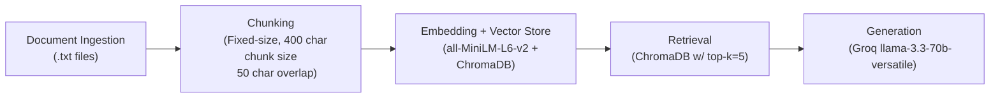

# Project 1 Planning: The Unofficial Guide

> Write this document before you write any pipeline code.
> Your spec and architecture diagram are what you'll use to direct AI tools (Claude, Copilot, etc.) to generate your implementation — the more specific they are, the more useful the generated code will be.
> Update the Retrieval Approach and Chunking Strategy sections if you change your approach during implementation.
> Update this file before starting any stretch features.

---

## Domain
The domain chosen is food reviews/opinions for places near CUNY Hunter College. Platforms like Yelp aggregate generalized public reviews, but don't take into account the context of what matters to a student of the college - factors like proximity, price, and speed of service, among other things. These factors are especially important for college students looking for a convenient, fast, and affordable place to eat near campus.
<!-- What domain did you choose? Why is this knowledge valuable and hard to find through official channels? -->
---

## Documents

<!-- List your specific sources: URLs, subreddit names, forum threads, or file descriptions.
     Aim for at least 10 sources that together cover different subtopics or perspectives within your domain. -->

| # | Source | Type | URL or file path |
|---|--------|------|-----------------|
| 1 | Reddit | Thread on Food Recommendations near Hunter College |https://www.reddit.com/r/HunterCollege/comments/1j9nlfh/food_places_by_hunter/ |
| 2 | Reddit | Another Thread on Food Recommendations| https://www.reddit.com/r/HunterCollege/comments/1fu67yc/food_spots/|
| 3 | Reddit | Food Recommendation Thread with Focus on Affordability| https://www.reddit.com/r/HunterCollege/comments/1ovsxsd/good_affordable_food_rec/|
| 4 |Yelp|Terry and Yaki Foodcart Reviews | https://www.yelp.com/biz/terry-and-yaki-new-york?osq=Terry+and+Yaki|
| 5 |Yelp|Hunter College Cafeteria Reviews |https://www.yelp.com/biz/hunter-college-cafeteria-new-york |
| 6 |Yelp |Hunter Delicatessen Reviews | https://www.yelp.com/biz/hunter-delicatessen-new-york|
| 7 |Yelp |Chipotle near Hunter Reviews | https://www.yelp.com/biz/chipotle-mexican-grill-new-york-85|
| 8 | Yelp|Tacombi near Hunter Reviews |https://www.yelp.com/biz/tacombi-upper-east-side-new-york-2 |
| 9 |Yelp |Gourmet Bagel near Hunter Reviews | https://www.yelp.com/biz/gourmet-bagel-new-york|
| 10 |Yelp |Korean Express near Hunter Reviews |https://www.yelp.com/biz/korean-express-new-york |

---

## Chunking Strategy
**Strategy:** Fixed-size chunking

**Chunk size:**
400 characters

**Overlap:**
50-75 characters

**Reasoning:**
Large enough chunk size to accomodate most reviews and reddit comments, with some overlap to handle entries that cross chunk boundaries. Yelp reviews are self contained opinions that tend to be longer than the average Reddit comment, so 400 characters acts as a good size to contain this upper-bound case. Fixed-size chunking works better here because reviews don't follow consistent formatting conventions across sources. Reddit threads are aggregated as full documents prior to chunking, so comments will for the most part be grouped with surrounding context.
<!-- How will you split documents into chunks?
     State your chunk size (in tokens or characters), overlap size, and explain why those
     numbers fit the structure of your documents.
     A review-heavy corpus warrants different chunking than a long FAQ. -->
---

## Retrieval Approach
**Embedding model:**
sentence-transformers (all-MiniLM-l6-v2)

**Top-k:**
5 - a few options need to be weighted for the average query in this scenario, given that it is polling between a number of options/opinions to give the best predicted response

**Production tradeoff reflection:**
Context length would be a consideration, as most Yelp reviews and compacted reddit threads exceed the token limit of weaker models, meaning that upgrading to a model with a bigger token limit would be the primary solution to one of the core bottlenecks of this guide. Latency would also have to be consideration especially if we made the rational choice to scale the number of documents used to form chunks, in the hopes of a more informed answer from the model.
<!-- Which embedding model are you using (e.g., all-MiniLM-L6-v2 via sentence-transformers)?
     How many chunks will you retrieve per query (top-k)?
     If you were deploying this for real users and cost wasn't a constraint, what tradeoffs
     would you weigh in choosing a different embedding model — context length, multilingual
     support, accuracy on domain-specific text, latency? -->
---

## Evaluation Plan

<!-- List your 5 test questions with their expected correct answers.
     Questions should be specific enough that you can judge whether the system's response
     is right or wrong. "What are good dining halls?" is too vague.
     "What do students say about wait times at [dining hall name] during lunch?" is testable. -->

| # | Question | Expected answer |
|---|----------|-----------------|
| 1 | What do students say about the Hunter College cafeteria?|It is convenient in location, but limited in options, and overpriced relative to what you get |
| 2 | Is the Chipotle near Hunter worth going to?|It's a relatively affordable option but has questionable food quality |
| 3 | Where can I eat near Hunter if I'm on a budget?| Chipotle, McDonalds, Hunter Halal Cart. A mixed bag of answers possible here, but mostly leans towards these three |
| 4 | What do people say about the Halal carts near Hunter|They are a frequented food source, but have mixed, slightly negative-leaning opinion about them |
| 5 | How is service quality at Gourmet Bagel| Reviews on Yelp cite generally good service quality and accomodating staff, albeit with a few bad experiences sprinkled in |

---

## Anticipated Challenges
1. Harsh variety in response quality based on uneven review/opinion distribution for given places (some places have 17 reviews, others have 300, so I'm not sure how that might be handled, albeit the lower reviewed places on Yelp are mentioned a little more frequently on the Reddit threads)

2. Uncertainty in response for places that have mixed/varying reviews. This could manifest in many forms, such as places where there might be a generally positive outlook on Yelp, but generally negative outlook on Reddit (for example, the latter might weigh price more heavily in overall review)
<!-- What could go wrong? Name at least two specific risks with reasoning.
     Consider: noisy or inconsistent documents, missing source attribution, off-topic
     retrieval, chunks that split key information across boundaries. -->

---

## Architecture

<!-- Draw a diagram of your pipeline showing the five stages:
     Document Ingestion → Chunking → Embedding + Vector Store → Retrieval → Generation
     Label each stage with the tool or library you're using.
     You can use ASCII art, a Mermaid diagram, or embed a sketch as an image.
     You'll use this diagram as context when prompting AI tools to implement each stage. -->
---

## AI Tool Plan (TODO)

<!-- For each part of the pipeline below, describe:
     - Which AI tool you plan to use (Claude, Copilot, ChatGPT, etc.)
     - What you'll give it as input (which sections of this planning.md, which requirements)
     - What you expect it to produce
     - How you'll verify the output matches your spec

     "I'll use AI to help me code" is not a plan.
     "I'll give Claude my Chunking Strategy section and ask it to implement chunk_text()
     with my specified chunk size and overlap" is a plan. -->

**Milestone 3 — Ingestion and chunking:**
I'll give Claude my chunking strategy and document outline, and from that ask it to implement ingest.py, which loads txt fils from a documents directory, cleans the boilerplate data using RegEx patterns, and splits the cleaned text into fixed-size 400 character chunks, storing them in a persistent ChromaDB collection afterwards.

**Milestone 4 — Embedding and retrieval:**
I'll give Claude my retrieval approach section and the chunk-metadata structure generated from ingest, and ask it to generate a retrieval function in query.py to open the existing CDB collection, accept a query string, and return the top-5 most relevant chunks alongside the filenames and distance scores.

**Milestone 5 — Generation and interface:**
I'll give Claude my full planning.md file and query.py, and ask it to implement grounded generation using llama-3.3-70b-versatile, with a system prompt to restrict answers to specific given context only, and create a Gradio web interface that acts as the UI for the full RAG pipeline for this project.
